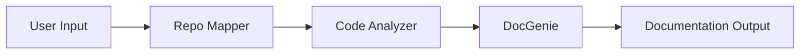

# 🧠 Codebase Genius
**AI-Powered Automatic Code Documentation Generator**

Transform any GitHub repository into comprehensive, professional documentation in seconds using advanced multi-agent AI architecture.

[](https://python.org)
[](https://www.jac-lang.org/)
[](https://deepmind.google/technologies/gemini/)
[](LICENSE)

## ✨ Features
* 🗺️ **Smart Repository Mapping** - Automatically analyzes repository structure
* 🔍 **Deep Code Analysis** - Extracts functions, classes, imports, and dependencies  
* 📝 **Auto Documentation** - Generates comprehensive markdown documentation
* 📊 **Architecture Diagrams** - Creates Mermaid diagrams for visualization
* 🤖 **AI-Powered Summarization** - Uses Gemini AI to understand and summarize codebases
* 🎨 **Beautiful UI** - Modern Streamlit interface for easy interaction

## 🏗️ Architecture
Codebase Genius uses a **multi-agent architecture** built with Jac language:

### Agent Pipeline


### Agents
1. **Repo Mapper Agent**
   * Clones GitHub repositories
   * Generates file tree structure
   * Finds and reads README files
   * AI-powered README summarization

2. **Code Analyzer Agent**
   * Parses Python source files using AST
   * Extracts functions, classes, and imports
   * Builds Code Context Graph (CCG)
   * Identifies entry points (main.py, app.py, etc.)

3. **DocGenie Agent**
   * Generates markdown documentation
   * Creates architecture diagrams
   * Produces API reference
   * Saves output to files

## 🚀 Installation

### Prerequisites
* Python 3.10+
* Git
* Gemini API Key ([Get one here](https://aistudio.google.com/))

### Setup
1. **Clone the repository:**
   ```bash
   git clone <your-repo>
   cd codebase_genius
   ```

2. **Create virtual environment:**
   ```bash
   python3 -m venv venv
   source venv/bin/activate  # On Windows: venv\Scripts\activate
   ```

3. **Install dependencies:**
   ```bash
   cd BE
   pip install -r requirements.txt
   cd ../FE  
   pip install -r requirements.txt
   ```

4. **Configure API Key:**
   ```bash
   cd BE
   echo "GEMINI_API_KEY=your_api_key_here" > .env
   ```

## 💻 Usage

### Method 1: Web Interface (Recommended)
1. **Start the backend server:**
   ```bash
   cd BE/v1
   source ../../v-env/bin/activate
   jac serve main.jac
   ```

2. **Start the frontend (new terminal):**
   ```bash
   cd FE
   source ../v-env/bin/activate
   streamlit run app.py
   ```

3. **Open browser:**
   * Navigate to `http://localhost:8501`
   * Login/Register
   * Enter GitHub repository URL
   * Click "Generate Documentation"
   * Download your documentation!

### Method 2: API (Advanced)
```bash
# Login
curl -X POST http://localhost:8000/user/create \
-H "Content-Type: application/json" \
-d '{"username": "your_username", "password": "your_password"}'

# Generate documentation
curl -X POST http://localhost:8000/walker/code_genius \
-H "Content-Type: application/json" \
-H "Authorization: Bearer YOUR_TOKEN" \
-d '{"fields": {"repo_url": "https://github.com/pallets/click", "session_id": ""}}'
```

## 📊 Example Output
Generated documentation includes:
* **Project Overview** - AI-generated summary
* **Statistics** - File, function, and class counts  
* **Entry Points** - Main application entry files
* **File Structure** - Complete file tree with details
* **API Reference** - Detailed function and class documentation
* **Architecture Diagram** - Mermaid visualization

## 🛠️ Tech Stack
| Technology | Purpose |
| --- | --- |
| **Jac Language** | Multi-agent orchestration |
| **Gemini AI (2.5 Flash)** | Natural language understanding |
| **Python AST** | Code parsing and analysis |
| **Streamlit** | Web interface |
| **GitPython** | Repository management |
| **Markdown** | Documentation format |
| **Mermaid** | Diagram generation |

## 📁 Project Structure
```
codebase_genius/
├── BE/                          # Backend
│   ├── v1/
│   │   ├── main.jac             # Main walker & orchestration
│   │   ├── utils.jac            # Utility functions
│   │   ├── code_analyzer.jac
│   │   ├── doc_genie.jac
│   │   ├── code_analyzer_helper.py
│   │   └── doc_genie_helper.py
│   ├── .env                     # API keys
│   └── requirements.txt         # Backend dependencies
├── FE/                          # Frontend
│   ├── app.py                   # Streamlit UI
│   └── requirements.txt         # Frontend dependencies
├── outputs/                     # Generated documentation
└── README.md
```

## 🎯 Supported Languages
Currently supports:
* ✅ **Python** (fully supported)

Coming soon:
* 🚧 JavaScript/TypeScript
* 🚧 Java  
* 🚧 Go

## 🤝 Contributing
Contributions are welcome! Please follow these steps:
1. Fork the repository
2. Create a feature branch (`git checkout -b feature/amazing-feature`)
3. Commit your changes (`git commit -m 'Add amazing-feature'`)
4. Push to the branch (`git push origin feature/amazing-feature`)
5. Open a Pull Request

## 📝 License
This project is licensed under the MIT License - see the [LICENSE](LICENSE) file for details.

## 🙏 Acknowledgments
* [Jac Language](https://www.jac-lang.org/) - Multi-agent framework
* [Google Gemini](https://deepmind.google/technologies/gemini/) - AI models
* [Streamlit](https://streamlit.io/) - Web framework
* [Python AST](https://docs.python.org/3/library/ast.html) - Code parsing

**Made with ❤️ using Jac, Streamlit, and Gemini AI**